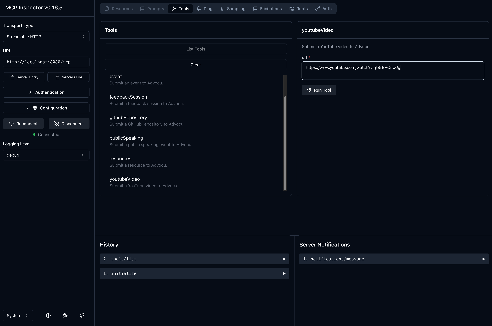

# Advocu MCP Server

This project provides a [Model-Centric Programming (MCP) server](https://docs.quarkiverse.io/quarkus-mcp-server/dev/index.html) for submitting activities to [Advocu](https://advocu.com/). It exposes a set of tools that can be called by an MCP client to create activity drafts in your Advocu account.



## Running the Application

The easiest way to run the Advocu MCP Server is by using the pre-built Docker container available on Docker Hub.

### Prerequisites

- Docker installed on your machine.
- Your Advocu Personal API Token.
- Your Advocu Submission ID.

### Running the Docker Container

To run the container, you need to map port 8080 and provide your Advocu credentials as environment variables.

```shell script
docker run -p 8080:8080 \
  -e ADVOCU_API_TOKEN="YOUR_ADVOCU_API_TOKEN" \
  -e ADVOCU_SUBMISSION_ID="YOUR_ADVOCU_SUBMISSION_ID" \
  olegselajev241/mcp-advocu-submissions:latest
```

Replace `"YOUR_ADVOCU_API_TOKEN"` and `"YOUR_ADVOCU_SUBMISSION_ID"` with your actual credentials.

### Connecting to the MCP Server

Once the container is running, you can connect to the MCP server using an SSE (Server-Sent Events) client. The server URL is:

`http://localhost:8080/mcp/sse`

## Available Tools

The following tools are available through the MCP server:

- `feedbackSession`: Submit a feedback session.
- `resources`: Submit a resource (e.g., blog post, article).
- `publicSpeaking`: Submit a public speaking engagement.
- `event`: Submit an event you organized.
- `amplification`: Submit a social media amplification.
- `githubRepository`: Submit a GitHub repository.
- `youtubeVideo`: Submit a YouTube video.

## Building from Source

If you prefer to build the project from source, you can use the following Maven command:

```shell script
./mvnw package
```

To build the container image locally:

```shell script
./mvnw package -DskipTests=true -Dquarkus.container-image.build=true
```